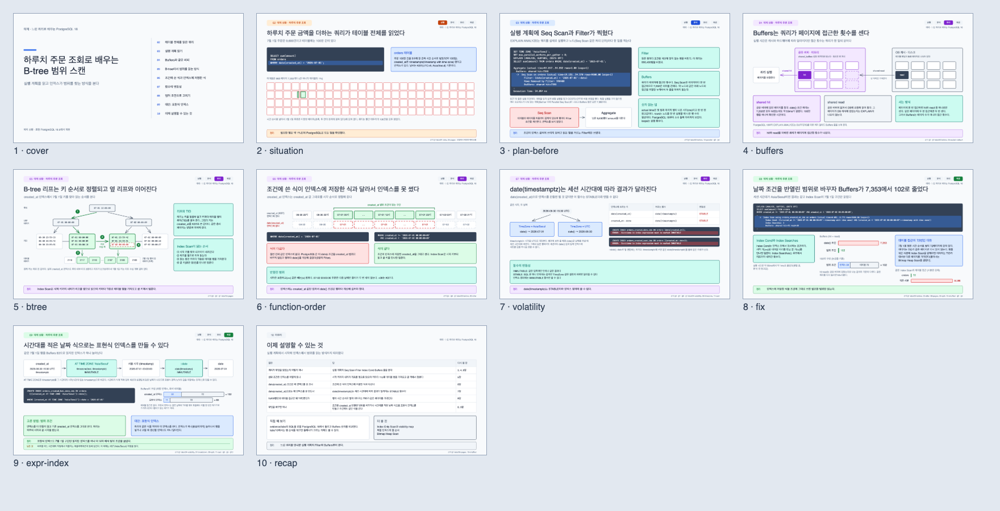
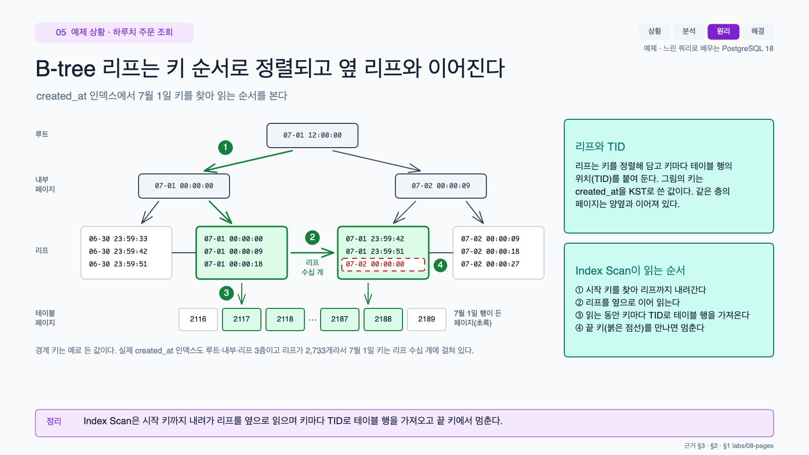
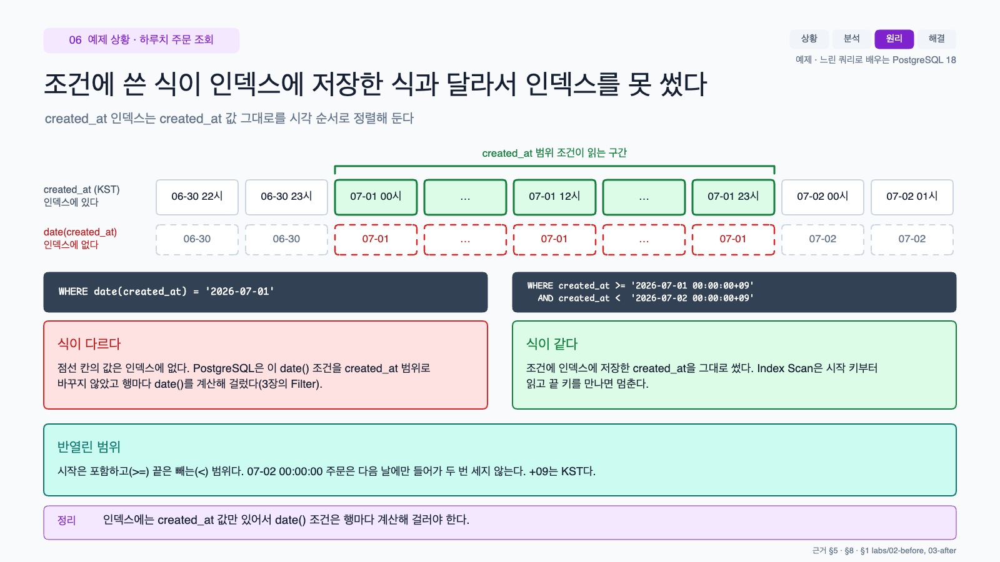

# excalidraw-study

주제와 구성을 알려 주면 Excalidraw 슬라이드로 학습 자료를 만드는 에이전트 스킬입니다.\
Claude Code와 Codex에서 쓸 수 있습니다.

결과물은 `.excalidraw` 파일 하나이고 슬라이드 한 장이 1600x900 프레임 하나입니다.\
excalidraw.com이나 VS Code·Obsidian의 Excalidraw 확장에서 바로 열 수 있습니다.



<p>
  
  
</p>

위 그림은 [`examples/pg-date-range-ko`](examples/pg-date-range-ko)에 있는 예제입니다.\
느린 쿼리 하나를 따라가며 실행 계획과 B-tree 범위 스캔을 설명합니다.\
슬라이드의 숫자는 모두 로컬 PostgreSQL 18에서 돌린 실험 결과입니다.

## 설치

### npx skills

```sh
npx skills add DongKey777/excalidraw-study-skill
```

### Claude Code 플러그인

```
/plugin marketplace add DongKey777/excalidraw-study-skill
/plugin install excalidraw-study@excalidraw-study-skill
```

### 직접 연결

```sh
git clone https://github.com/DongKey777/excalidraw-study-skill
cd excalidraw-study-skill

# Claude Code
ln -s "$PWD/skills/excalidraw-study" ~/.claude/skills/excalidraw-study

# Codex
ln -s "$PWD/skills/excalidraw-study" ~/.agents/skills/excalidraw-study
```

Codex는 프로젝트 안의 `.agents/skills/` 폴더에 두어도 스킬을 찾습니다.

### 필요한 것

- Node.js 18 이상
- Chrome, Edge, Chromium 중 하나
- 첫 렌더링 때 인터넷 연결

브라우저가 없다면 `npx playwright-core install chromium`으로 설치하면 됩니다.\
렌더러는 처음 한 번 `~/.cache/excalidraw-study` 폴더에 내려받습니다(약 40MB).

## 쓰는 법

에이전트에게 주제와 구성을 말하면 됩니다.

```
엑스칼리드로우로 PostgreSQL MVCC 학습 자료를 만들어줘.
우리 팀이 겪은 사건 세 개를 순서대로 따라가면서 개념을 익히게 해 줘.
사건 자료는 docs/incidents/ 에 있고 숫자는 이해를 돕는 것만 써.
```

```
Make an Excalidraw study on HTTP caching for new backend developers.
Concept-first, about 15 slides, verify every header behaviour with curl.
```

에이전트는 요청을 `brief.md`에 정리하고 필요한 질문을 한 번에 묻습니다.\
그다음 아래 순서로 진행합니다.

| 단계 | 하는 일 | 파일 |
|---|---|---|
| 근거 | 사실을 출처와 함께 적고 동작은 직접 돌려 확인합니다 | `evidence/` |
| 구성 | 장마다 전할 한 문장과 그림을 정합니다 | `plan.md` |
| 그리기 | 슬라이드를 코드로 쓰고 빌드합니다 | `slides/` |
| 검토 | 검사기를 돌리고 렌더링한 장을 하나씩 봅니다 | `review.json` |
| 감사 | 만들지 않은 에이전트가 사실과 설명 순서를 다시 봅니다 | `audits/` |
| 전달 | 확인한 것과 확인하지 못한 것을 적어서 건넵니다 | `README.md` |

자료의 흐름은 주제에 맞춰 고릅니다.\
사용자가 구성을 정해 주면 그 구성을 따릅니다.

| 흐름 | 어울리는 주제 | 단계 |
|---|---|---|
| 사건 (기본) | 실제로 겪은 장애나 프로젝트 | 상황 → 분석 → 원리 → 해결 |
| 개념 | 하나씩 쌓아 가며 배우는 주제 | 질문 → 개념 → 동작 → 적용 |
| 비교 | 두 설계, 두 버전, 두 도구 | 질문 → 기준 → 비교 → 고르기 |
| 둘러보기 | 시스템을 처음부터 끝까지 따라가기 | 구성 요소별 |

## 검사기

`check.mjs`는 빌드, 검사, 렌더링을 한 번에 합니다.\
렌더링 뒤에는 브라우저가 그린 실제 글자 폭으로 다시 검사합니다.

주로 이런 것을 잡습니다.

- 상자를 넘치거나 다른 요소와 겹치는 글자
- 글자를 지나가는 화살표, 크게 비어 있는 영역
- 너무 작은 글자와 낮은 대비
- 설명하기 전에 쓴 용어
- 근거 목록에 없거나 아직 확인하지 않은 주장
- 금지어, 대시, 섞인 말투, 번역투

전체 규칙은 `lint.mjs --rules`로 볼 수 있습니다.\
경고를 남겨 두려면 그 요소나 장에 이유를 적어야 합니다.

## 명령

보통은 에이전트가 실행하지만 직접 돌려도 됩니다.\
아래 경로는 `skills/excalidraw-study/scripts/` 폴더 기준입니다.

| 명령 | 하는 일 |
|---|---|
| `node new.mjs <dir> --flow case` | 자료 폴더 만들기 |
| `node check.mjs <dir>` | 빌드, 검사, 렌더링 |
| `node review.mjs <dir> --mark 1-9` | 본 장 기록 |
| `node review.mjs <dir> --audit facts` | 감사 결과 기록 |
| `node claims.mjs <dir> --apply rows.md` | 근거 행 합치기 |

`--flow`에는 `case`, `concept`, `comparison`, `tour` 중 하나를 넣습니다.\
감사 보고서는 `--file report.md`를 붙이면 `audits/` 폴더에 함께 남습니다.

## 배경

PostgreSQL 학습 자료를 여러 번 만들면서 다듬은 방식을 스킬로 옮겼습니다.

그림부터 그리면 틀린 숫자가 끝까지 남았습니다.\
만든 사람이 다시 봐서는 개념 오류를 놓치기 쉬웠습니다.\
그래서 근거 목록을 먼저 쓰고 감사는 다른 에이전트에게 맡깁니다.

디자인 원칙 일부는 impeccable, design-taste-frontend 같은 다른 스킬에서 가져왔습니다.\
출처는 [THIRD_PARTY_NOTICES.md](THIRD_PARTY_NOTICES.md)에 있습니다.

## 개발

```sh
npm test          # 단위 테스트 (브라우저 없이)
npm run example   # 예제 전체 검사와 렌더링
```

## English

An agent skill for Claude Code and Codex. Tell it the topic and the structure you want, and it builds a study material as Excalidraw slides: one `.excalidraw` file with a 1600x900 frame per slide.

Facts go into an evidence file with their sources before any slide is drawn, and claims about behaviour are checked by running them locally. A linter checks layout, text and sources. Every slide is rendered with Excalidraw's own exporter and looked at, and a separate agent reviews the result before delivery.

Install with `npx skills add DongKey777/excalidraw-study-skill` or see the install section above. The workflow is in [SKILL.md](skills/excalidraw-study/SKILL.md), and [the example](examples/pg-date-range-ko) shows the result. Korean writing rules are the default; set `lang: "en"` for English.

## License

MIT
